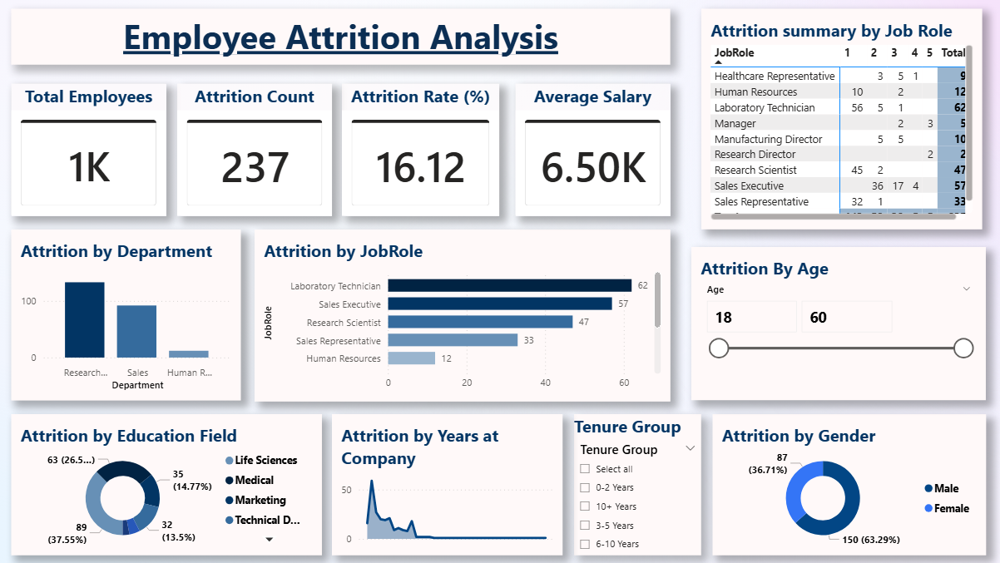
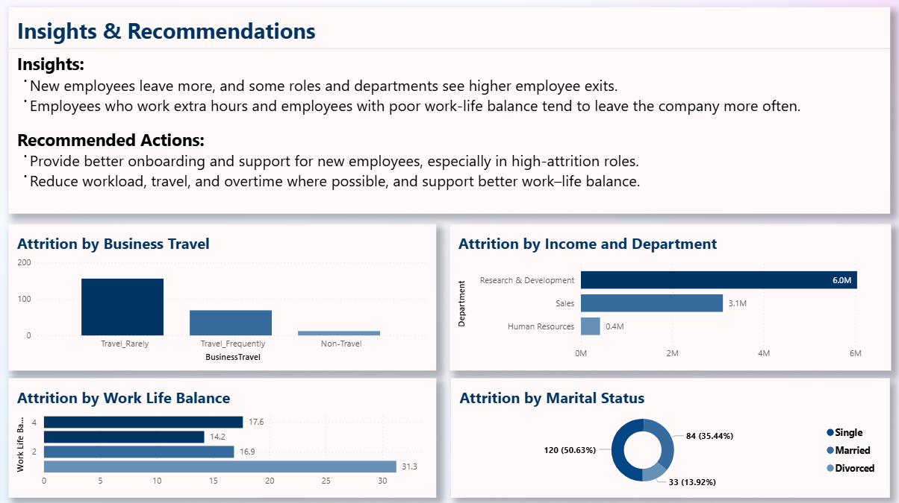

# Employee Attrition Analysis – Power BI + Machine Learning

## Overview
This project combines **Power BI employee analytics** with a **Machine Learning attrition prediction pipeline**.

The Power BI dashboard explains historical attrition patterns, while the ML layer predicts an employee's probability of attrition and assigns a **Low / Medium / High risk band**.

## Business Problem
HR teams need to understand:
- Which employee groups have higher attrition?
- What factors are associated with employees leaving?
- Which current employees may be at higher risk of attrition?
- Where should HR focus retention interventions?

## Project Workflow

**Raw HR data → Data cleaning → Exploratory analysis → Power BI dashboard → ML classification → Attrition probability → Risk bands → HR intervention**

## ML Approach

### Target
`Attrition`
- `Yes` → 1
- `No` → 0

### Models
1. **Logistic Regression**
   - Used as the interpretable baseline and selected employee risk-scoring model.
   - `class_weight="balanced"` is used because attrition is the minority class.
   - Coefficients are exported to explain which features increase/decrease predicted risk.

2. **Random Forest**
   - Used as a nonlinear benchmark.
   - Captures interactions that a linear model may miss.

### Preprocessing
- Numeric missing values → median imputation
- Categorical missing values → most-frequent imputation
- Categorical variables → one-hot encoding
- Numeric variables → standardization
- Identifier/constant columns removed: `EmployeeNumber`, `EmployeeCount`, `Over18`, `StandardHours`

### Model Evaluation
On a stratified 80/20 holdout set:

| Model | Accuracy | Precision | Recall | F1 | ROC-AUC |
|---|---:|---:|---:|---:|---:|
| Logistic Regression | 75.17% | 34.88% | **63.83%** | **45.11%** | **80.32%** |
| Random Forest | **84.35%** | **51.85%** | 29.79% | 37.84% | 78.77% |

For an HR retention use case, recall is important because failing to identify a potentially departing employee can mean missing an opportunity for intervention. Therefore, Logistic Regression is used as the primary risk-scoring model.

> Important: ML probability is a risk signal, not a statement that an employee will definitely leave. It should support HR analysis rather than replace human judgment.

## ML Outputs

The `ml_outputs/` folder contains:

- `employee_attrition_predictions.csv` — original employee data + predicted attrition probability + prediction + risk band
- `model_comparison.csv` — model evaluation metrics
- `logistic_feature_importance.csv` — interpretable logistic-regression coefficients
- `model_metrics.txt` — readable evaluation report

### Risk Bands
- **Low:** probability < 30%
- **Medium:** 30%–60%
- **High:** > 60%

## Power BI Integration

The existing PBIX dashboard can be extended with the ML output:

1. Run:
   ```bash
   python ml_attrition_prediction.py
   ```
2. In Power BI Desktop, choose **Get Data → Text/CSV**.
3. Import:
   `ml_outputs/employee_attrition_predictions.csv`
4. Relate it to the existing employee table using `EmployeeNumber`.
5. Add:
   - Average Attrition Probability
   - Number of High-Risk Employees
   - Risk Band distribution
   - Attrition probability by department/job role
   - High-risk employee table
6. Add conditional formatting to highlight High-risk employees.

This creates a useful **Predictive HR Analytics** page alongside the existing descriptive dashboard.

## Files

- `Employee_Attrition_Dataset.csv` — HR dataset
- `Employee_Attrition_Analysis_Using_PowerBI.pbix` — Power BI dashboard
- `Employee Attrition Analysis.ipynb` — existing exploratory analysis
- `ml_attrition_prediction.py` — ML training and prediction pipeline
- `ml_outputs/` — generated model results and Power BI-ready predictions
- `Attrition_Overview.png` — dashboard preview
- `Attrition_Drivers.png` — dashboard preview

## Tools Used
- Python
- Pandas
- Scikit-learn
- Power BI
- DAX
- Data Cleaning & Exploratory Data Analysis
- Logistic Regression
- Random Forest
- Classification metrics

## How to Run

Install dependencies:

```bash
pip install pandas numpy scikit-learn
```

Then run:

```bash
python ml_attrition_prediction.py
```

The generated CSV can be imported directly into Power BI.

## Dataset
The dataset used for this project is included in the repository for analysis and learning purposes.

=======
# Employee Attrition Analysis – Power BI

## Overview
This project uses Power BI to analyse employee data and
understand why employee leaves a company.

## Key Insights
- Overall attrition rate
- Department and job role analysis
- Impact of age, salary, and experience
- Interactive slicers for deep analysis

## Tools Used
- Power BI
- DAX
- Data Cleaning & Modeling

## How to Use
Download the PBIX file and open it using Power BI Desktop.

## Dashboard Preview

<<<<<<< HEAD

=======


## Dataset
The dataset used for this analysis is included in this repository
for reference and learning purposes.


